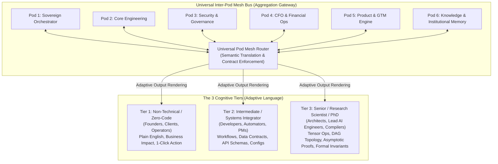

# Universal Pod Mesh & Multi-Tier Cognitive Language Architecture

---

## Executive Overview: The JVI Universal Communication & Teaching Bus

In the JVI Enterprise Ecosystem, autonomous agents (`AGENT-ORCH-001`, `AGENT-TECHDIR-014`, `AGENT-CFO-002`, etc.) and human stakeholders collaborate across 6 specialized departments (Pods). To eliminate cognitive friction, miscommunication, and knowledge silos, the system enforces a **3-Tier Adaptive Cognitive Language Protocol** and an **Inter-Pod Universal Mesh Bus**.



---

## 🎓 The 3-Tier Cognitive Language Standard

Every system communication, status update, diagnostic report, and documentation node in JVI must support dynamic projection across 3 distinct audience baselines:

### Tier 1: Operator / Non-Technical Baseline (Zero-Code Plain-Language)
- **Audience:** Non-technical founders, operators, general staff, clients.
- **Linguistic Rules:**
  1. Strictly zero technical jargon, raw acronyms (e.g. AST, DAG, DPO, RAG), or unparsed stack traces.
  2. Use tangible real-world analogies (e.g., "smart filing cabinet" instead of "vector embeddings"; "visual train tracks" instead of "cubic Bézier DAG rails").
  3. Format output around 3 core questions:
     - **What happened?** (High-level summary)
     - **Why does it matter to the business?** (Revenue, speed, safety)
     - **What do you need to do?** (Single clear 1-click decision or action)

### Tier 2: Builder / Intermediate Systems Integrator (Applied Engineering)
- **Audience:** Full-stack developers, n8n automators, technical product managers, standard worker agents.
- **Linguistic Rules:**
  1. Focus on operational flow, data schemas, API parameters, component contracts, and state transitions.
  2. Provide copy-pasteable configuration blocks, CLI commands, and step-by-step troubleshooting logic.
  3. Explicitly document inputs, outputs, error codes, and rollback commands.

### Tier 3: Architect / Research Scientist / PhD-Level (Deep Theory & Formal Proofs)
- **Audience:** Senior staff architects, AI/ML research scientists, autonomous code compilers.
- **Linguistic Rules:**
  1. Rigorous mathematical and algorithmic formulations (e.g., $O(V + E)$ complexity, parametric Bernstein polynomial splines, loss functions, Markov decision processes).
  2. Formal verification proofs, memory safety invariants, memory bus bandwidth analysis, and low-level GPU kernel/AST mechanics.
  3. Comprehensive benchmark metrics with sample sizes ($N$), standard deviations ($\sigma$), and p-values.

---

## 🏛️ Universal Inter-Pod Mesh Routing Protocol

```mermaid
sequenceDiagram
    autonumber
    participant Sender as Pod 4: CFO Agent (AGENT-CFO-002)
    participant Mesh as Universal Pod Mesh Router
    participant Receiver1 as Human Operator (Tier 1)
    participant Receiver2 as Tech Director (Pod 2 / Tier 3)

    Sender->>Mesh: Dispatches Financial Telemetry Payload
    Note over Mesh: Validates against universal_mesh_message.schema.json
    Mesh->>Receiver1: Renders Tier 1: "Cash reserves are healthy; weekly expenses down 8%."
    Mesh->>Receiver2: Renders Tier 3: "SQL View daily_agent_roi materialized at 10ms latency; variance delta sigma=0.04."
```

### Pod Mesh Topology & Bounded Contexts

| Pod ID | Pod Name | Lead Agent | Primary Bounded Context |
|---|---|---|---|
| **Pod 1** | Sovereign Orchestration | `AGENT-ORCH-001` | Ecosystem state, goal dispatch, cross-machine sync |
| **Pod 2** | Core Engineering | `AGENT-TECHDIR-014` | Codebases, transpilers, CI/CD, unit/E2E test suites |
| **Pod 3** | Security & Governance | `AGENT-SEC-050` | Credential security, PII sentinels, storage isolation |
| **Pod 4** | CFO & Financial Ops | `AGENT-CFO-002` | EBITDA, POS analytics, unit economics, cashflow |
| **Pod 5** | Product & GTM Systems | `AGENT-PRD-042` / `AEO-003` | Lead generation, Bento launchpads, marketing copy |
| **Pod 6** | Knowledge & Memory | `AGENT-GRAPHMOM-025` | Knowledge graph, NotebookLM MCP, Docling ingestion |

---

## 📚 The End-to-End Pedagogical Didactic Engine

Every autonomous agent in the JVI ecosystem implements the `DidacticTeacher` interface. When asked to explain any system, concept, or incident, the agent dynamically generates a 3-tier pedagogical walkthrough:

```
┌────────────────────────────────────────────────────────────────────────┐
│                      DIDACTIC TEACHING INTERFACE                       │
├────────────────────────────────────────────────────────────────────────┤
│ 1. THE HOOK (Tier 1): Intuitive mental model & everyday metaphor       │
│ 2. THE BLUEPRINT (Tier 2): Architecture, data flow, & component steps  │
│ 3. THE ENGINE (Tier 3): Mathematical proofs, low-level code & bounds   │
│ 4. THE PRACTICUM: Interactive sandbox exercise with instant feedback   │
└────────────────────────────────────────────────────────────────────────┘
```

---

## 🔒 Governance & CEO Invariant Gate
- Inter-pod communication is strictly governed by `universal_mesh_message.schema.json`.
- Automatic translation between cognitive tiers must never alter underlying factual assertions or data points.
- No pod may unilaterally alter shared ecosystem rules or business goals without explicit CEO approval.
