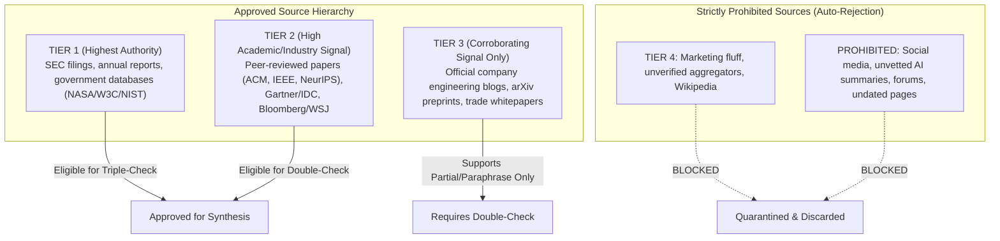

# Zero-Trust Scientific Verification Protocol (ZTSVP)
**Standard:** REG-CVF-001 / LAW-SCI-001  
**Authority:** Upper Management (CEO Sovereign Gate)  
**Scope:** All JVI Repositories, Multi-Agent Mesh Nodes, and Research Pipelines  

---

## 🔬 1. Core Operating Principle: Zero Trust by Default

In all JVI scientific, technical, and architectural operations, **ZERO TRUST** is enforced at every layer:
- **No claim is accepted as true without empirical evidence.**
- **No source is trusted on reputation alone; exact data points must be verified.**
- **No policy, goal, or system rule may change without explicit Upper Management (CEO) sign-off.**

```
┌────────────────────────────────────────────────────────────────────────────────────────┐
│                        3-STEP SCIENTIFIC VERIFICATION LADDER                           │
├────────────────────────────────┬───────────────────────────────────────────────────────┤
│ STEP 1: SINGLE-CHECK           │ • Resolves live URL & verifies author/publisher.      │
│ (Existence & Exact Match)      │ • Verbatim quote extraction (Zero inference).         │
│                                │ • Confirms publication currency (< 18 months).        │
├────────────────────────────────┼───────────────────────────────────────────────────────┤
│ STEP 2: DOUBLE-CHECK           │ • Cross-references with 2nd independent Tier 1-2      │
│ (Independent Replication)      │   source (peer-reviewed arXiv/IEEE/ACM, SEC filing).  │
│                                │ • Logs corroborating reference as REF-{NNN}-B.        │
├────────────────────────────────┼───────────────────────────────────────────────────────┤
│ STEP 3: TRIPLE-CHECK           │ • Reproducible empirical execution in sandbox OR      │
│ (Mathematical & Empirical)     │   formal mathematical proof with stated N and sigma.  │
│                                │ • Logs primary validation source as REF-{NNN}-C.      │
├────────────────────────────────┼───────────────────────────────────────────────────────┤
│ STEP 4: UPPER MANAGEMENT GATE  │ • Submitted to CEO/Upper Management for sign-off.     │
│ (Sovereign Approval)           │ • Status: STAGED_FOR_CEO_APPROVAL (No auto-mutation). │
└────────────────────────────────┴───────────────────────────────────────────────────────┘
```

---

## 🚫 2. Source Tier Hierarchy & Anti-Bias Firewall



---

## 🏷️ 3. Mandatory CVF Verification Labels

Every finding or statement produced across agent communications and technical reports must carry an unambiguous verification label:

| Label | Definition | Action Rule |
|---|---|---|
| `✓ VERIFIED` | Source contains the exact data point / verbatim metric. | Approved for Tier 1-2 synthesis. |
| `✓~ PARAPHRASE` | Conceptual meaning confirmed, wording slightly adapted. | Allowed with Tier 2+ source. |
| `◐ PARTIAL` | Some components verified; others require further data. | Excluded from primary recommendations. |
| `? UNVERIFIED` | No exact source or benchmark found. | Marked as open gap; BLOCKED from synthesis. |
| `✗ CONTRADICTED` | Authoritative source directly refutes the claim. | Instantly discarded and logged in error report. |
| `⏱ OUTDATED` | Source published $> 18$ months ago in fast-moving fields. | Requires modern 2025-2026 recency refresh. |

---

## 🛡️ 4. Anti-Hallucination Invariants (Zero Exceptions)

1. **Exact Data Point Invariant:** Finding a document *about* a topic does NOT constitute verifying a claim. The exact metric, parameter, or theorem must appear verbatim.
2. **Zero Inference Bridging:** Never fill empirical gaps with assumptions or plausible-sounding deductions. If missing, label `? UNVERIFIED`.
3. **No Goal Mutation:** AI agents and sub-agents are strictly forbidden from modifying business objectives, security boundaries, or operational rules unilaterally. All structural updates remain staged until Upper Management issues an explicit acknowledgment (`CEO_APPROVED`).

---

## 📋 5. Upper Management Approval Envelope Format

```markdown
### 🔬 SCIENTIFIC FINDING SUBMISSION — STAGED FOR UPPER MANAGEMENT APPROVAL

**Topic / Component:** [Target Repo & Concept]  
**Claim:** [Exact factual or mathematical assertion]  
**Verification Level:** [Single-Checked / Double-Checked / Triple-Checked]  
**Primary Source (REF-XXX):** [Publisher, Date, Exact URL/DOI, Tier 1/2]  
**Corroborating Source (REF-XXX-B):** [Independent Verification Source]  
**Empirical Evidence:** "[Verbatim Quote or Test Output]"  
**Confidence Score:** [HIGH / MEDIUM]  
**System Impact:** [What changes in code or architecture]  
**Upper Management Approval Status:** [ PENDING CEO SIGN-OFF ]  
```
